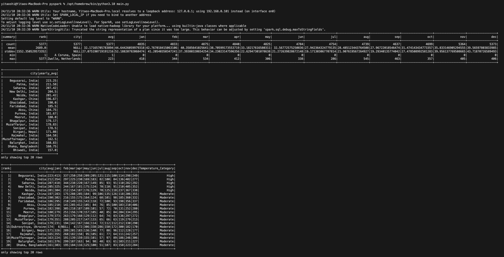

# PySpark Data Processing Project

This project demonstrates using PySpark to perform data processing tasks on a substantial dataset. The main goals include executing SQL queries on the data, performing descriptive analyses, and applying data transformations. The project uses FiveThirtyEight’s dataset of “Daily Show” guests, providing insights into the show’s guest history and enabling structured data operations.

## Picture of result


## Project Objectives

1. **Data Extraction and Loading**: Retrieve and load the dataset from an external source.
2. **Data Exploration**: Use Spark SQL to generate descriptive statistics and execute queries.
3. **Data Transformation**: Apply transformations to derive new insights or reformat data for better understanding.

---

## Preparation

To set up and run the project, follow these steps:

1. **Open Codespaces**: Launch the project in GitHub Codespaces for an automated environment setup.
2. **Wait for Installation**: Allow the environment to install necessary dependencies, such as Python, PySpark, and other libraries.
3. **Run the Main Script**: Execute the main Python script to start the data processing pipeline.
   ```bash
   python main.py
   ```
4. **View the Output**: Check the output summary in the Markdown file generated by the script for insights and results.
   - [PySpark Output Data/Summary Markdown File](pyspark_output.md)

---

## Code Formatting and Testing

This project includes commands to maintain code quality through formatting, linting, and testing.

1. **Format Code**: Automatically format code for consistency using `black`.
   ```bash
   make format
   ```
2. **Lint Code**: Analyze code for potential errors and ensure code style compliance using `flake8`.
   ```bash
   make lint
   ```
3. **Test Code**: Run unit tests to verify that all functions perform as expected.
   ```bash
   make test
   ```

---

## Data Processing Workflow

The main processing flow includes a series of steps from data extraction to session termination. Each step is handled by functions in `mylib/lib.py`.

1. **Extract the Dataset**: 
   - The `extract` function retrieves the dataset from a specified URL and saves it locally. This ensures that the data is available for processing within the container environment.
   - *Example*:
     ```python
     extract()
     ```

2. **Start the Spark Session**: 
   - The `start_spark` function initializes a PySpark session. This session is crucial for handling distributed data processing and enables SQL operations on large datasets.
   - *Example*:
     ```python
     spark = start_spark("DailyShowGuests")
     ```

3. **Load Data into a DataFrame**: 
   - Using the `load_data` function, the extracted dataset is read into a Spark DataFrame, making it easier to perform operations such as transformations and queries.
   - *Example*:
     ```python
     df = load_data(spark)
     ```

4. **Generate Descriptive Statistics**:
   - The `describe` function calculates basic descriptive statistics for the dataset, including counts, means, and standard deviations, providing an overview of the data’s structure.
   - *Example*:
     ```python
     describe(df)
     ```

5. **Query the Data**:
   - Using the `query` function, SQL queries are executed on the DataFrame to gain insights. For example, counting guests per year provides a sense of the show’s historical guest trends.
   - *Example*:
     ```python
     query(
         spark,
         df,
         sql,
     )
     ```

6. **Apply Data Transformations**:
   - The `example_transform` function performs specific transformations on the dataset, such as categorizing occupations. This step enhances the dataset by adding meaningful labels, making analysis easier.
   - *Example*:
     ```python
     example_transform(df)
     ```

7. **End the Spark Session**:
   - Finally, the `end_spark` function stops the Spark session, releasing resources and ensuring a clean shutdown.
   - *Example*:
     ```python
     end_spark(spark)
     ```

---

## Output and Results

The output of this project includes:
1. A structured Markdown file (`pyspark_output.md`) containing the summary of data operations, including descriptive statistics and query results.
2. Log files or console output, which detail each step’s execution and provide insights into the data processing flow.

---

## References

This project setup and structure are inspired by templates and best practices for Python data projects. Key resources include:

1. **Template**: [Python Ruff Template](https://github.com/nogibjj/python-ruff-template)
2. **PySpark Documentation**: For reference on PySpark functions and API usage.
